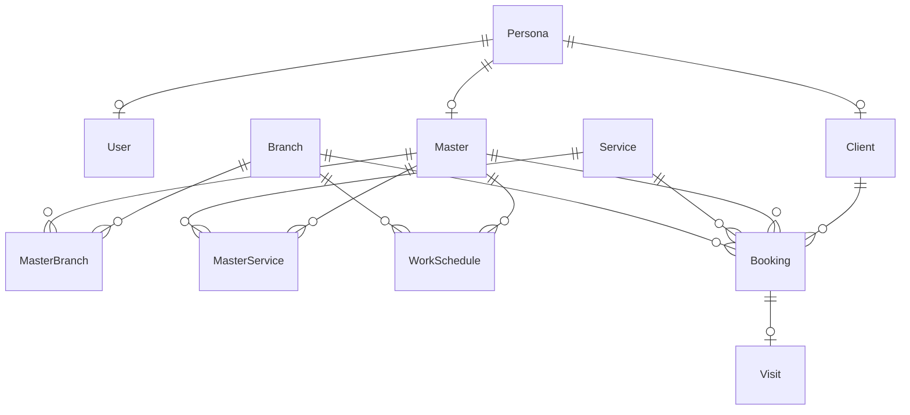

# 2 Анализ и постановка задачи

> Раздел соответствует главе «2 Анализ и постановка задачи» по образцу ВКР данного руководителя. Содержит четыре подраздела: описание предметной области, определение спецификаций ПО, проектирование модели данных, конструирование прототипа. Ориентировочный объём — 10–11 страниц.

## 2.1 Описание предметной области

Предметной областью разрабатываемой системы является процесс управления взаимоотношениями с клиентами в сети барбершопов «Тихий час». В состав сети входят несколько территориально разнесённых филиалов, в каждом из которых работает штат мастеров (барберов), оказывающих перечень услуг (стрижка, оформление бороды, бритьё, комплексные услуги и т. п.). Клиентами сети являются преимущественно мужчины в возрасте от 18 до 45 лет, регулярно посещающие барбершоп с интервалом 2–4 недели и, как правило, закреплённые за конкретным мастером.

Типовой процесс обслуживания клиента включает следующие этапы:

– клиент выбирает филиал, услугу, мастера и удобный временной слот;
– клиент создаёт запись на приём (через сайт, по телефону или непосредственно в филиале);
– перед визитом клиент получает напоминание о записи; в день визита клиент приходит к назначенному времени;
– мастер оказывает услугу; администратор филиала фиксирует факт оказания услуги и принимает оплату;
– информация о визите сохраняется в клиентской базе для использования в дальнейшем.

Ключевыми отличительными особенностями работы сети барбершопов, влияющими на состав и логику программных модулей, являются:

– **жёсткая привязка клиента к мастеру.** В отличие от обычной парикмахерской, где клиент готов записаться к любому свободному мастеру, в барбершопе клиент целенаправленно выбирает «своего» барбера. Это требует поддержки в системе индивидуального расписания каждого мастера и выбора мастера на стороне клиента;

– **различная длительность услуг.** Стандартная длительность стрижки — 30–45 минут, оформления бороды — 30 минут, комплексной услуги — 60–90 минут. Алгоритм поиска свободных слотов должен учитывать длительность выбранной услуги, чтобы исключить наложение записей;

– **мультифилиальность сети.** Услуги, прайс-лист и клиентская база — общие для всей сети, но мастера и расписания привязаны к конкретному филиалу. Это требует разделения уровня видимости данных в зависимости от роли пользователя (администратор филиала видит только свой филиал, владелец сети — все филиалы);

– **высокая доля повторных визитов.** Постоянные клиенты возвращаются раз в 2–4 недели, поэтому история визитов и быстрая повторная запись существенно влияют на качество обслуживания;

– **возможность гостевой записи.** Значительная часть первичных клиентов не готова заводить личный кабинет до первого визита. Система должна поддерживать запись по имени и телефону без обязательной регистрации.

### Обзор аналогов

На рынке присутствует ряд готовых решений для автоматизации салонов красоты и барбершопов, наиболее распространённые из которых рассмотрены ниже.

**YCLIENTS** — облачная платформа для записи клиентов в сферу beauty-услуг. Поддерживает онлайн-запись, журнал записи, клиентскую базу, отправку SMS-уведомлений, программы лояльности. Преимущества: широкая функциональность, высокая надёжность. Недостатки: значительная стоимость подписки в пересчёте на каждый филиал; универсальность приводит к избыточности и сложности интерфейса; ограниченные возможности кастомизации бизнес-логики под особенности конкретной сети.

**DIKIDI** — облачная система онлайн-записи и CRM для бьюти-сферы. Преимущества: бесплатный базовый тариф, удобное мобильное приложение для клиента. Недостатки: сильное брендирование платформы вместо бренда сети, ограниченная гибкость отчётов, преимущественно «универсальная» бизнес-логика.

**1С:Салон красоты** — отраслевое решение на платформе 1С:Предприятие. Преимущества: глубокая интеграция с учётными контурами (бухгалтерия, склад, кадры). Недостатки: высокая стоимость владения; необходимость подготовленного администратора 1С; интерфейс ориентирован на персонал, а не на конечного клиента; онлайн-запись требует дополнительных модулей.

**Sonline** — российская SaaS-CRM для салонов красоты с возможностью онлайн-записи. По функциональности и ограничениям близка к YCLIENTS.

Проведённый обзор показывает, что универсальные решения, ориентированные на широкий профиль beauty-услуг, либо не учитывают специфики барбершопов, либо являются дорогими в пересчёте на филиал, либо ограничивают возможности кастомизации. Это обосновывает целесообразность разработки собственной CRM-системы, специализированной под бизнес-процессы конкретной сети барбершопов.

## 2.2 Определение спецификаций программного обеспечения

### 2.2.1 Роли пользователей

В системе выделяются пять ролей пользователей. Состав ролей и их основные возможности приведены в таблице 2.1.

**Таблица 2.1 — Роли пользователей системы**

| Роль | Авторизация | Ключевые возможности |
|---|---|---|
| Гость | не требуется | Просмотр филиалов, мастеров, услуг; запись на приём по имени и телефону. |
| Клиент | требуется | + личный кабинет с историей визитов; быстрая повторная запись; (опц.) бонусные баллы. |
| Мастер | требуется | Просмотр и ведение собственного расписания; отметка о выполнении услуги; служебные заметки о клиенте. |
| Администратор филиала | требуется | Управление записями, расписаниями мастеров и клиентской базой собственного филиала; ручное создание, перенос и отмена записей. |
| Владелец сети | требуется | Все возможности администратора по всем филиалам; управление справочниками филиалов, услуг и мастеров; аналитические отчёты. |

### 2.2.2 Функциональные требования

Функциональные требования к системе сгруппированы по программным модулям.

**Модуль М1. Управление филиалами и услугами:**

– FR-1.1. Система должна поддерживать ведение справочника филиалов (наименование, адрес, рабочие часы, контакты).
– FR-1.2. Система должна поддерживать ведение справочника услуг (наименование, длительность, базовая цена, описание).
– FR-1.3. Система должна поддерживать ведение справочника мастеров с привязкой к одному или нескольким филиалам и подмножеству услуг.

**Модуль М2. Роли и доступ:**

– FR-2.1. Система должна обеспечивать регистрацию и авторизацию пользователей по логину (электронной почте или номеру телефона) и паролю.
– FR-2.2. Система должна поддерживать роли: клиент, мастер, администратор филиала, владелец сети.
– FR-2.3. Система должна разграничивать доступ к данным: администратор филиала видит данные только своего филиала; владелец сети — всех филиалов.

**Модуль М3. Онлайн-запись:**

– FR-3.1. Система должна предоставлять незарегистрированному пользователю возможность записи на приём с указанием имени и контактного телефона.
– FR-3.2. Система должна обеспечивать выбор филиала, услуги (или комбинации услуг), мастера и временного слота.
– FR-3.3. Система должна автоматически рассчитывать перечень свободных временных слотов на выбранный день с учётом длительности услуги, рабочих часов мастера и существующих записей.
– FR-3.4. Система должна проверять, что новая запись не пересекается с существующими записями выбранного мастера, и в случае конфликта отклонять создание записи.
– FR-3.5. Система должна сохранять контактный телефон гостевой записи в клиентской базе и при последующей регистрации этого клиента связывать его историю с авторизованным профилем.

**Модуль М4. Расписание мастеров:**

– FR-4.1. Система должна предоставлять мастеру календарное представление его записей на день, неделю и месяц.
– FR-4.2. Система должна позволять мастеру или администратору филиала отмечать рабочие, нерабочие и обеденные интервалы.
– FR-4.3. Система должна позволять администратору филиала вручную создавать, переносить и отменять записи.
– FR-4.4. Система должна фиксировать факт оказания услуги (статус «выполнена») и сумму к оплате.

**Модуль М5. Клиентская база:**

– FR-5.1. Система должна вести карточку клиента (имя, телефон, дата рождения, дата первого и последнего визита, число визитов, средний чек).
– FR-5.2. Система должна отображать историю визитов клиента в хронологическом порядке.
– FR-5.3. Система должна поддерживать ведение служебных заметок мастера о клиенте.

**Модуль М6. Аналитика:**

– FR-6.1. Система должна формировать отчёт «Загрузка мастеров» (количество отработанных часов и процент загрузки за период).
– FR-6.2. Система должна формировать отчёт «Выручка по филиалам» (сумма выручки за период с разбивкой по филиалам).
– FR-6.3. Система должна формировать отчёт «Удержание клиентов» (доля повторно вернувшихся клиентов за период).
– FR-6.4. Система должна формировать отчёт «Топ услуг» (рейтинг услуг по количеству оказаний и выручке).

### 2.2.3 Нефункциональные требования

– NFR-1. Время отклика системы на основные пользовательские операции (открытие страницы записи, формирование списка слотов) не должно превышать 2 секунд при работе одновременно до 50 пользователей.
– NFR-2. Интерфейс системы должен быть адаптивным и корректно отображаться на устройствах с шириной экрана от 320 до 1920 пикселей.
– NFR-3. Пароли пользователей должны храниться в виде криптографических хешей с применением соли; передача данных аутентификации должна осуществляться по протоколу HTTPS.
– NFR-4. Система должна обеспечивать резервное копирование базы данных не реже одного раза в сутки.
– NFR-5. Архитектура системы должна допускать расширение функциональности (добавление новых модулей) без модификации существующих модулей.

### 2.2.4 Сценарии использования (Use Cases)

Основные варианты использования системы приведены в таблице 2.2.

**Таблица 2.2 — Перечень основных вариантов использования**

| Идентификатор | Актор | Вариант использования |
|---|---|---|
| UC-01 | Гость | Записаться на приём без регистрации |
| UC-02 | Гость | Просмотреть перечень филиалов, мастеров и услуг |
| UC-03 | Клиент | Зарегистрироваться в системе |
| UC-04 | Клиент | Войти в личный кабинет |
| UC-05 | Клиент | Просмотреть историю своих визитов |
| UC-06 | Клиент | Повторить запись по аналогии с предыдущим визитом |
| UC-07 | Мастер | Просмотреть расписание на день/неделю |
| UC-08 | Мастер | Отметить услугу как выполненную |
| UC-09 | Мастер | Внести заметку о клиенте |
| UC-10 | Администратор филиала | Создать / перенести / отменить запись вручную |
| UC-11 | Администратор филиала | Управлять расписанием мастеров (отпуска, больничные) |
| UC-12 | Администратор филиала | Просмотреть карточку клиента |
| UC-13 | Владелец сети | Управлять справочником филиалов |
| UC-14 | Владелец сети | Управлять справочником услуг и мастеров |
| UC-15 | Владелец сети | Просмотреть аналитические отчёты по сети |

В качестве ключевого варианта использования рассматривается UC-01 «Записаться на приём без регистрации» — он реализует основной сценарий получения дохода сетью и наиболее показателен с точки зрения логики системы.

**Описание варианта использования UC-01 «Записаться на приём без регистрации».**

Краткое описание: Гость заходит на сайт сети и самостоятельно записывается на приём, не создавая личного кабинета.

Предусловия:
– Пользователь открыл главную страницу сайта;
– в системе существует хотя бы один филиал, услуга и мастер.

Основной поток событий:

1. Гость выбирает филиал из списка.
2. Гость выбирает одну или несколько услуг из прайс-листа выбранного филиала.
3. Система отображает перечень мастеров филиала, оказывающих выбранные услуги.
4. Гость выбирает мастера.
5. Гость выбирает дату.
6. Система рассчитывает и отображает свободные временные слоты на выбранную дату с учётом длительности услуги, рабочих часов мастера и существующих записей.
7. Гость выбирает свободный слот.
8. Гость указывает имя и контактный телефон.
9. Система создаёт запись со статусом «создана» и фиксирует её в базе данных.
10. Система отображает экран с подтверждением записи (номер записи, дата, время, мастер, услуги, итоговая стоимость).

Альтернативные потоки:

– А1 (отсутствие свободных слотов): на шаге 6 свободных слотов нет; система предлагает выбрать другую дату или другого мастера.
– А2 (конфликт записи в момент сохранения): на шаге 9 другой пользователь параллельно занял слот; система информирует об этом и предлагает выбрать другой слот.

Постусловие: запись создана и доступна для просмотра администратору филиала и мастеру.

## 2.3 Проектирование модели данных

На основе анализа функциональных требований, ролевой модели и сценариев использования, описанных в подразделе 2.2, разработана модель структуры данных проектируемой CRM-системы. Модель выполнена в виде ER-диаграммы (диаграммы «сущность–связь»), позволяющей формализованно описать логическую структуру данных, на основе которой в дальнейшем (подраздел 3.2) разрабатывается физическая структура для хранения во внешней памяти и программной обработки.

При проектировании модели данных применён классический подход «выноса общих атрибутов» в отдельную сущность: персональные данные физического лица (фамилия, имя, отчество, контактный телефон, дата рождения), общие для всех ролей пользователей системы (клиент, мастер, администратор), выделены в отдельную сущность `Persona`. Специализированные сущности (`Client`, `Master`, `User`) ссылаются на `Persona` через внешний ключ, что исключает дублирование персональных данных в случае, когда одно физическое лицо выступает в нескольких ролях (например, мастер может быть одновременно клиентом сети).

ER-диаграмма модели данных CRM-системы сети барбершопов «Тихий час» приведена на рисунке 2.1.

Рисунок 2.1 — ER-диаграмма модулей CRM-системы сети барбершопов «Тихий час»

> *Примечание для черновика:* финальная ER-диаграмма для подачи в ПЗ оформляется в нотации Crow's Foot средствами `dbdiagram.io` или StarUML и помещается в этот раздел в виде растрового изображения. Mermaid-диаграмма выше используется как «исполняемая» спецификация модели на этапе разработки.

Описание характеристик сущностей и связей между сущностями ER-диаграммы из рисунка 2.1 приведено в таблице 2.3. Структура данных приведена к третьей нормальной форме реляционных структур данных: каждый неключевой атрибут зависит только от первичного ключа и не зависит транзитивно от других неключевых атрибутов; персональные данные, общие для всех ролей, вынесены в отдельную сущность `Persona`.

**Таблица 2.3 — Характеристика сущностей и связей между сущностями ER-диаграммы**

| Сущность | Назначение сущности | Ключ | Характеристика связи |
|---|---|---|---|
| `Persona` | Содержит общие персональные данные физического лица:  – PersonaId;  – LastName;  – FirstName;  – MiddleName;  – Phone;  – Email;  – BirthDate;  – Gender. | PersonaId (PK). | Persona — User (1…1);  Persona — Client (1…1);  Persona — Master (1…1). |
| `User` | Содержит данные учётной записи пользователя для авторизации в системе (реализуется средствами ASP.NET Core Identity):  – UserId;  – PersonaId;  – UserName;  – PasswordHash;  – Email;  – PhoneNumber. | UserId (PK);  PersonaId (FK, UNIQUE). | User — Persona (1…1). |
| `Branch` | Содержит данные о филиале сети барбершопов:  – BranchId;  – Name;  – Address;  – Phone;  – OpeningTime;  – ClosingTime. | BranchId (PK). | Branch — MasterBranch (1…n);  Branch — WorkSchedule (1…n);  Branch — Booking (1…n). |
| `Service` | Содержит данные об услуге прайс-листа сети:  – ServiceId;  – Name;  – Description;  – DurationMinutes;  – Price. | ServiceId (PK). | Service — MasterService (1…n);  Service — Booking (1…n). |
| `Master` | Содержит данные мастера-барбера; общие персональные данные хранятся в `Persona`, специфичные для роли мастера атрибуты — в этой сущности:  – MasterId;  – PersonaId;  – Position;  – HireDate;  – AvatarPath;  – Bio;  – IsActive. | MasterId (PK);  PersonaId (FK, UNIQUE). | Master — Persona (1…1);  Master — MasterBranch (1…n);  Master — MasterService (1…n);  Master — WorkSchedule (1…n);  Master — Booking (1…n). |
| `MasterBranch` | Содержит данные о привязке мастера к филиалу (связь N:M):  – MasterId;  – BranchId. | (MasterId, BranchId) — составной PK;  MasterId (FK);  BranchId (FK). | MasterBranch — Master (n…1);  MasterBranch — Branch (n…1). |
| `MasterService` | Содержит данные о перечне услуг, которые умеет оказывать мастер (связь N:M):  – MasterId;  – ServiceId. | (MasterId, ServiceId) — составной PK;  MasterId (FK);  ServiceId (FK). | MasterService — Master (n…1);  MasterService — Service (n…1). |
| `WorkSchedule` | Содержит данные о рабочем графике мастера на конкретный день в конкретном филиале (рабочая смена, обед, выходной, отпуск):  – WorkScheduleId;  – MasterId;  – BranchId;  – WorkDate;  – StartTime;  – EndTime;  – ScheduleType. | WorkScheduleId (PK);  MasterId (FK);  BranchId (FK). | WorkSchedule — Master (n…1);  WorkSchedule — Branch (n…1). |
| `Client` | Содержит данные клиента сети барбершопов; общие персональные данные хранятся в `Persona`, специфичные для роли клиента — в этой сущности. Может существовать как «гостевой» клиент (без `User`) либо как авторизованный (с привязкой к `User` через `Persona`):  – ClientId;  – PersonaId;  – Source;  – Notes;  – FirstVisitDate;  – CreatedAt. | ClientId (PK);  PersonaId (FK, UNIQUE). | Client — Persona (1…1);  Client — Booking (1…n). |
| `Booking` | Содержит данные о записи клиента на приём — бронировании времени мастера на оказание услуги в конкретном филиале:  – BookingId;  – ClientId;  – MasterId;  – ServiceId;  – BranchId;  – StartDateTime;  – DurationMinutes;  – Status;  – CreatedAt. | BookingId (PK);  ClientId (FK);  MasterId (FK);  ServiceId (FK);  BranchId (FK). | Booking — Client (n…1);  Booking — Master (n…1);  Booking — Service (n…1);  Booking — Branch (n…1);  Booking — Visit (1…1). |
| `Visit` | Содержит данные о зафиксированном факте оказания услуги по записи (создаётся при переводе записи в статус «выполнена»):  – VisitId;  – BookingId;  – TotalAmount;  – MasterNotes;  – CompletedAt. | VisitId (PK);  BookingId (FK, UNIQUE). | Visit — Booking (1…1). |

Все первичные ключи (PK) являются счётчиками (IDENTITY) и имеют целочисленный тип данных int, за исключением составных ключей сущностей-связок `MasterBranch` и `MasterService`, где первичным является комбинация двух внешних ключей. Внешние ключи (FK) проставляются вручную в соответствии со связями между сущностями. Для сущностей `User`, `Client`, `Master` внешний ключ `PersonaId` объявляется уникальным (UNIQUE), что обеспечивает связь типа «один к одному» с сущностью `Persona`. Реализация ролевой модели опирается на стандартные таблицы ASP.NET Core Identity (`AspNetUsers`, `AspNetRoles`, `AspNetUserRoles`, `AspNetUserClaims`), которые на ER-диаграмме обобщены сущностью `User` для упрощения восприятия; их подробная структура рассмотрена в подразделе 3.2.

## 2.4 Конструирование прототипа

Для уточнения интерфейсной части системы разработаны прототипы основных экранных форм. Прототипы выполняются в виде статических макетов; на этапе реализации (раздел 3) макеты воплощаются в виде HTML-страниц приложения.

### 2.4.1 Перечень экранов

В состав прототипа входят следующие экраны:

– **Э1. Главная страница сайта** — с возможностью перейти к онлайн-записи, ознакомиться с филиалами и мастерами.
– **Э2. Мастер записи. Шаг 1. Выбор филиала** — список филиалов с адресами и часами работы.
– **Э3. Мастер записи. Шаг 2. Выбор услуги** — прайс-лист услуг с указанием длительности и стоимости; возможность выбрать несколько услуг.
– **Э4. Мастер записи. Шаг 3. Выбор мастера** — карточки мастеров (фото, имя), оказывающих выбранные услуги.
– **Э5. Мастер записи. Шаг 4. Выбор даты и времени** — календарь с доступными датами и сетка свободных слотов на выбранную дату.
– **Э6. Мастер записи. Шаг 5. Контактные данные** — форма ввода имени и телефона; для авторизованного пользователя поля заполняются автоматически.
– **Э7. Подтверждение записи** — итоговая сводка: филиал, услуги, мастер, дата и время, итоговая стоимость, номер записи.
– **Э8. Личный кабинет клиента** — карточка клиента, история визитов, кнопка «повторить запись».
– **Э9. Кабинет мастера. Расписание на день** — список записей с временем, услугами, контактом клиента; кнопка «Отметить как выполненную».
– **Э10. Администратор филиала. Журнал записей** — табличное представление записей филиала с фильтрами по дате, мастеру, статусу.
– **Э11. Администратор филиала. Календарь мастеров** — представление недельного расписания нескольких мастеров одновременно (Gantt-подобная сетка).
– **Э12. Владелец сети. Дашборд** — ключевые показатели по сети: загрузка, выручка, удержание, топ услуг.

### 2.4.2 Принципы оформления

Прототипы экранов разрабатываются с соблюдением следующих принципов:

– **Минимум шагов от посещения сайта до записи.** Сценарий записи занимает не более пяти экранов (Э2 — Э6) и удерживает в фокусе пользователя только текущий шаг.
– **Адаптивность.** Все экраны корректно отображаются как на десктопе, так и на мобильных устройствах (NFR-2).
– **Единый визуальный стиль.** Используется единая цветовая палитра, типографика и компоненты интерфейса (кнопки, формы, таблицы, карточки).
– **Раздельные интерфейсы для клиентской части и панели администрирования.** Клиентская часть оптимизирована под скорость прохождения сценария записи; административная часть — под плотность отображения информации и эффективность операций.

Графические макеты прототипа приведены в приложении Б «Основные экранные формы и программный код» в виде скриншотов, оформление макетов выполняется в инструменте Figma.

---

> **Состояние черновика.** Данный раздел является черновиком и подлежит уточнению на этапе реализации (раздел 3). Конкретные числовые значения требований (производительность, нагрузка), окончательный перечень атрибутов сущностей и графические макеты экранов будут добавлены по мере выполнения работы.
