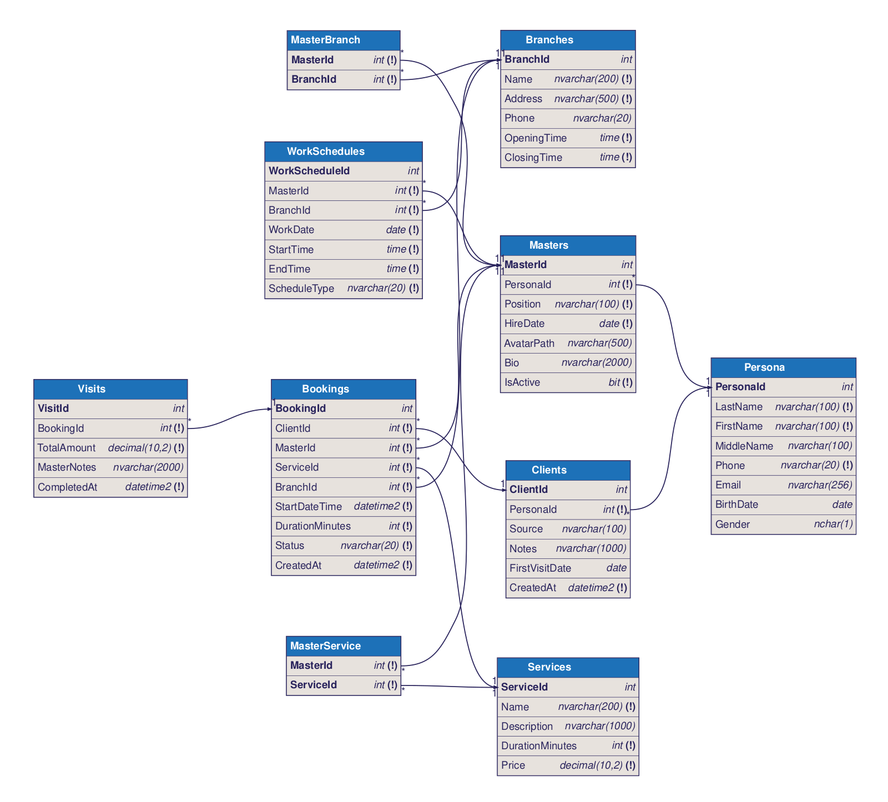
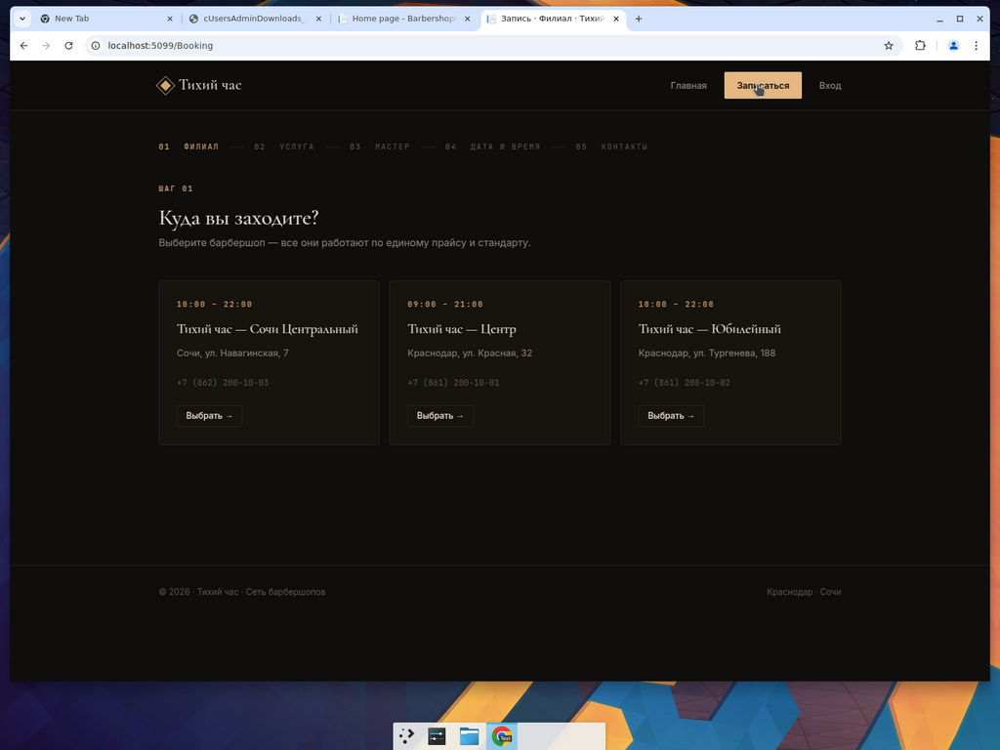
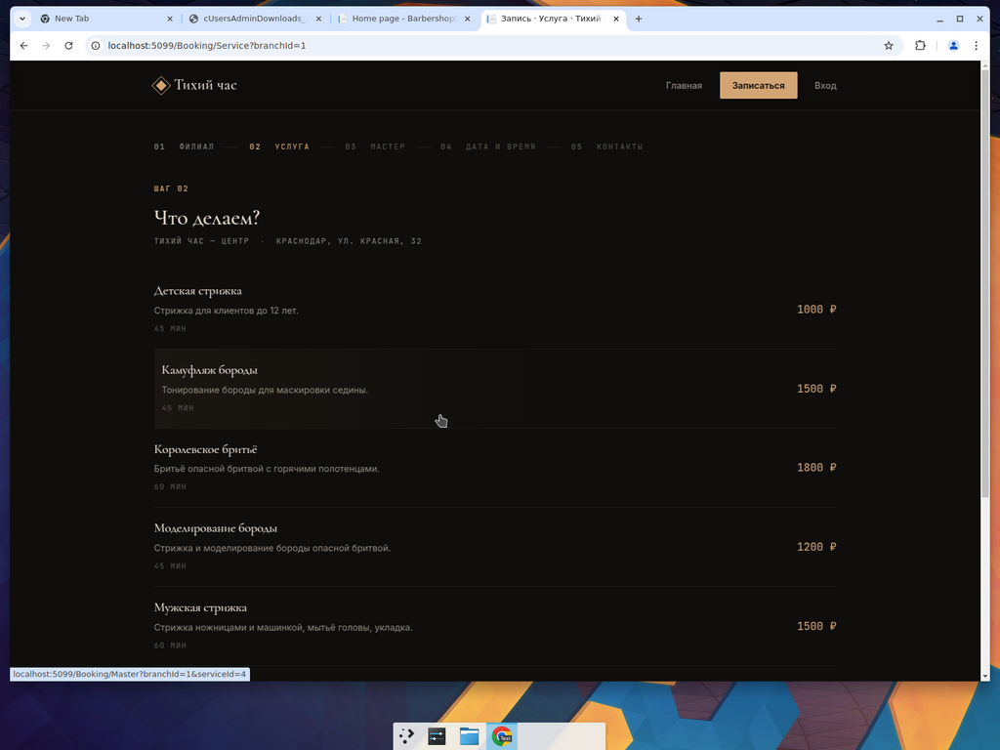
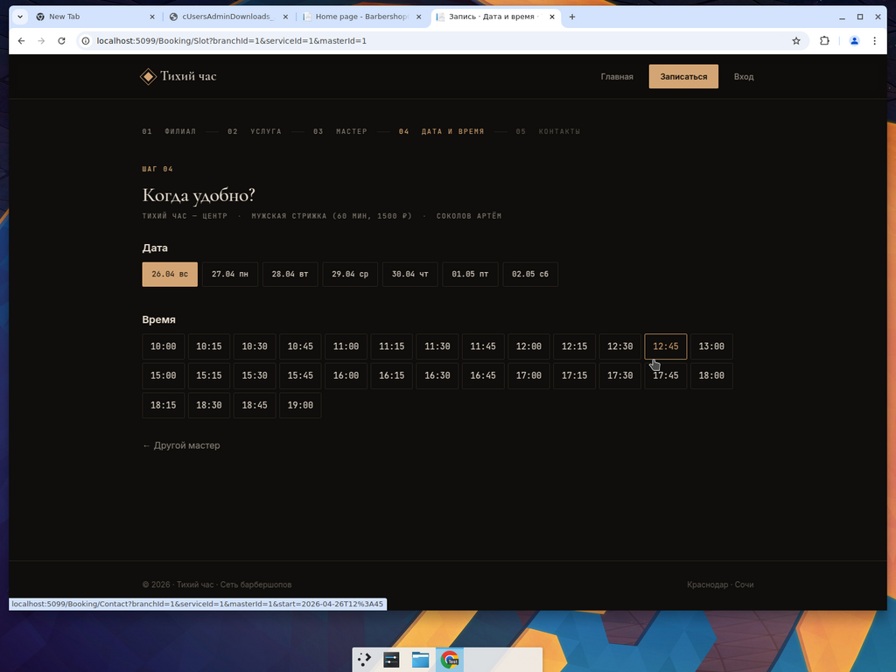
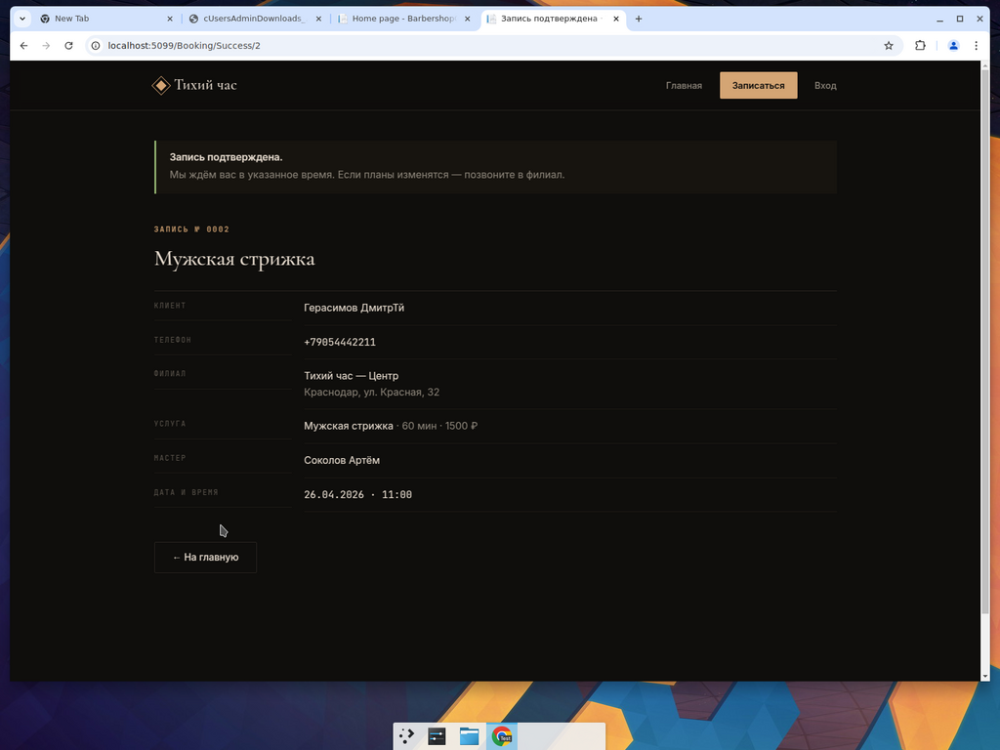
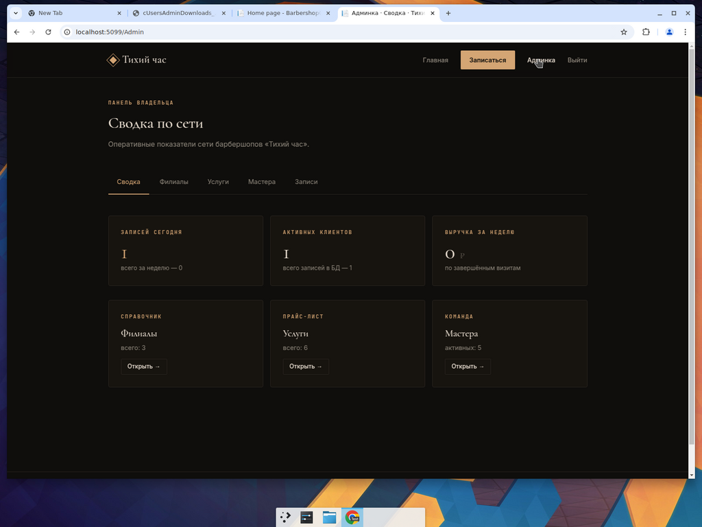

# 3 Реализация

> Раздел соответствует главе «3 Реализация» по образцу ВКР данного руководителя. Содержит три подраздела: обоснование выбора средств и методов разработки, разработка базы данных в среде СУБД, описание приложения. Ориентировочный объём — 8–10 страниц.

## 3.1 Обоснование выбора средств и методов разработки

Для реализации программных модулей системы управления взаимоотношениями с клиентами требуется сделать обоснованный выбор по четырём ключевым категориям инструментов: серверной программной платформе, системе управления базами данных, способу построения пользовательского интерфейса и среде разработки. Решения по каждой категории должны учитывать функциональные требования, сформулированные в подразделе 2.2, ограничения по срокам разработки в рамках выпускной квалификационной работы и доступность инструментов в учебной лаборатории.

### 3.1.1 Выбор серверной программной платформы

В качестве кандидатов рассмотрены три современные программные платформы, сопоставимые по уровню зрелости и подходящие для разработки многопользовательского веб-приложения с разграничением прав доступа: ASP.NET Core 8 (C#), Django 5 (Python) и Spring Boot 3 (Java). Сравнение проведено по семи критериям, существенным для решаемой задачи; результаты приведены в таблице 3.1.

Таблица 3.1 — Сравнение серверных программных платформ

| Критерий                                    | ASP.NET Core 8 | Django 5 | Spring Boot 3 |
|---------------------------------------------|:--------------:|:--------:|:-------------:|
| Поддержка типизированных языков             |       +        |    −     |       +       |
| Встроенный механизм аутентификации и ролей  |       +        |    +     |       +       |
| Кросс-платформенность (Windows / Linux)     |       +        |    +     |       +       |
| Производительность HTTP-сервера             |       +        |    −     |       +       |
| Готовый ORM с поддержкой миграций           |       +        |    +     |       +       |
| Серверный рендеринг страниц «из коробки»    |       +        |    +     |       −       |
| Освоенность в рамках учебной программы      |       +        |    −     |       −       |

«+» — критерий выполняется, «−» — критерий не выполняется или выполняется не в полной мере.

ASP.NET Core 8 удовлетворяет всем семи критериям. Платформа использует строго типизированный язык C#, поддерживает кросс-платформенный запуск (Windows / Linux / macOS), включает в себя встроенную систему аутентификации ASP.NET Core Identity с ролевой моделью доступа и шаблонизатор Razor Pages для серверного рендеринга страниц без необходимости отдельного клиентского фреймворка. Платформа изучается в рамках учебной программы по специальности 09.02.07.

Django 5 не удовлетворяет двум критериям из семи. Python не обеспечивает строгой статической типизации в той мере, в какой это даёт C#, что увеличивает риск ошибок несоответствия типов на этапе выполнения. Производительность HTTP-сервера на Python ниже, чем у компилируемых платформ, что становится существенным при обслуживании нескольких филиалов одновременно.

Spring Boot 3 не удовлетворяет одному критерию: в составе платформы отсутствует встроенный шаблонизатор для серверного рендеринга страниц (фреймворки Thymeleaf и JSP подключаются как сторонние компоненты), что увеличивает объём конфигурационных работ. Кроме того, освоенность платформы в рамках учебной программы существенно ниже.

На основе анализа результатов сравнения был сделан вывод, что в качестве серверной программной платформы целесообразно выбрать ASP.NET Core 8 как платформу, удовлетворяющую всем выдвинутым критериям одновременно.

### 3.1.2 Выбор системы управления базами данных

В качестве кандидатов на роль СУБД рассмотрены три реляционные системы, обеспечивающие поддержку транзакций, ссылочной целостности и индексации: Microsoft SQL Server 2019, PostgreSQL 16 и MySQL 8. Сравнение проведено по шести критериям; результаты приведены в таблице 3.2.

Таблица 3.2 — Сравнение систем управления базами данных

| Критерий                                                  | MS SQL Server 2019 | PostgreSQL 16 | MySQL 8 |
|-----------------------------------------------------------|:------------------:|:-------------:|:-------:|
| Поддержка транзакций уровня SERIALIZABLE                  |         +          |       +       |    +    |
| Поддержка проверочных ограничений (CHECK)                 |         +          |       +       |    +    |
| Графический клиент в комплекте                            |         +          |       −       |    −    |
| Прямая интеграция с Entity Framework Core                 |         +          |       +       |    +    |
| Поддержка в учебной лаборатории                           |         +          |       −       |    −    |
| Бесплатная редакция для разработки                        |         +          |       +       |    +    |

«+» — критерий выполняется, «−» — критерий не выполняется или выполняется не в полной мере.

Microsoft SQL Server 2019 удовлетворяет всем шести критериям. В составе пакета поставляется графический клиент SQL Server Management Studio (SSMS), позволяющий выполнять администрирование БД, написание запросов и просмотр схемы. Бесплатная редакция Developer Edition по функциональности не уступает редакции Enterprise и предназначена для использования в средах разработки и тестирования. Учебная лаборатория ГБПОУ КК ККЭП оснащена SQL Server и SSMS.

PostgreSQL 16 не удовлетворяет двум критериям. В составе дистрибутива отсутствует графический клиент, сопоставимый по функциональности с SSMS (популярный pgAdmin поставляется отдельно). Поддержка в учебной лаборатории не обеспечена, что усложняет демонстрацию работы системы на защите.

MySQL 8 не удовлетворяет тем же двум критериям, что и PostgreSQL.

На основе анализа результатов сравнения был сделан вывод, что в качестве системы управления базами данных целесообразно выбрать Microsoft SQL Server 2019.

### 3.1.3 Выбор подхода к построению пользовательского интерфейса

В рамках экосистемы ASP.NET Core 8 для построения пользовательского интерфейса доступны три подхода: серверный рендеринг страниц на основе Razor Pages, одностраничное приложение (Single Page Application, SPA) на основе Blazor WebAssembly и одностраничное приложение на стороннем клиентском фреймворке (React, Vue.js, Angular). Сравнение проведено по пяти критериям; результаты приведены в таблице 3.3.

Таблица 3.3 — Сравнение подходов к построению пользовательского интерфейса

| Критерий                                                | Razor Pages | Blazor WASM | React + Web API |
|---------------------------------------------------------|:-----------:|:-----------:|:---------------:|
| Время первоначальной загрузки страницы                  |      +      |      −      |        −        |
| Поддержка веб-приложения поисковыми системами (SEO)     |      +      |      −      |        −        |
| Объём конфигурационного кода                            |      +      |      −      |        −        |
| Использование одного языка программирования (C#)        |      +      |      +      |        −        |
| Возможность разработки в составе одного проекта         |      +      |      +      |        −        |

«+» — критерий выполняется, «−» — критерий не выполняется или выполняется не в полной мере.

Razor Pages удовлетворяет всем пяти критериям. Серверный рендеринг обеспечивает быструю первую отрисовку страницы и индексацию контента поисковыми системами, что существенно для общедоступного веб-сайта барбершопов. Бизнес-логика и пользовательский интерфейс реализуются на одном языке (C#) в составе одного проекта, что снижает порог входа и сокращает сроки разработки.

Blazor WASM не удовлетворяет трём критериям: одностраничное приложение требует загрузки исполняемой среды .NET в браузер пользователя, что увеличивает время первой загрузки и затрудняет SEO-индексацию.

Связка React + ASP.NET Core Web API не удовлетворяет четырём критериям. Помимо тех же проблем с первой загрузкой и SEO, подход требует разработки двух раздельных проектов на разных языках (C# для серверной части и JavaScript / TypeScript для клиентской), что увеличивает объём кода и срок разработки.

На основе анализа результатов сравнения был сделан вывод, что в качестве подхода к построению пользовательского интерфейса целесообразно выбрать серверный рендеринг страниц на основе Razor Pages.

### 3.1.4 Выбор среды разработки

В качестве среды разработки выбрана Microsoft Visual Studio 2022 Community Edition. Среда является бесплатной для использования в учебных целях, обеспечивает встроенную поддержку проектов ASP.NET Core 8, графический инструмент управления миграциями Entity Framework Core, графический редактор Razor-шаблонов, отладчик уровня исходного кода и интеграцию с системой контроля версий Git.

В качестве вспомогательного инструмента визуального проектирования модели данных использован веб-сервис dbdiagram.io, формирующий ER-диаграмму в нотации «вороньей лапки» (Crow's Foot) на основе текстового описания на языке DBML. Преимуществом данного подхода является возможность хранения исходного описания диаграммы в системе контроля версий вместе с исходным кодом приложения.

### 3.1.5 Выбор объектно-реляционного отображения

Доступ к базе данных в приложении реализован посредством объектно-реляционного отображения (Object-Relational Mapping, ORM) на основе библиотеки Entity Framework Core 8 — стандартного решения для ASP.NET Core. Применение ORM позволяет описывать сущности предметной области в виде типизированных классов C# (POCO) и формировать запросы к базе данных средствами интегрированного языка запросов LINQ, что обеспечивает контроль типов на этапе компиляции и снижает количество ошибок, связанных с написанием SQL-запросов вручную.

Для управления версиями схемы базы данных применён механизм миграций Entity Framework Core. Каждое изменение структуры сущностей сопровождается созданием миграции, представляющей собой пару SQL-сценариев «накат» и «откат». Это обеспечивает воспроизводимость структуры БД на любой машине разработки и тестирования путём выполнения единственной команды.

### 3.1.6 Выбор средств модульного тестирования

Для реализации модульных тестов выбрана связка библиотек xUnit.net 2 и Moq 4. xUnit.net является современной библиотекой модульного тестирования, штатно поддерживаемой в шаблонах проектов .NET 8. Moq применяется для создания подменных объектов (mock) при изоляции тестируемого кода от внешних зависимостей. Для подмены контекста Entity Framework Core в тестах используется встроенный поставщик `Microsoft.EntityFrameworkCore.InMemory`, обеспечивающий имитацию работы базы данных в оперативной памяти без подключения к реальной СУБД.

### 3.1.7 Сводная характеристика выбранных средств

Итоговый набор средств разработки и их назначение приведены в таблице 3.4.

Таблица 3.4 — Сводная характеристика выбранных средств разработки

| Категория                              | Выбранное средство                              | Назначение в проекте                                     |
|----------------------------------------|-------------------------------------------------|----------------------------------------------------------|
| Серверная программная платформа         | ASP.NET Core 8                                  | Обработка HTTP-запросов, маршрутизация, бизнес-логика    |
| Язык программирования                   | C# 12                                           | Реализация серверного кода и моделей                     |
| Шаблонизатор пользовательского интерфейса | Razor Pages                                   | Серверный рендеринг HTML-страниц                         |
| Система управления базами данных        | Microsoft SQL Server 2019                       | Хранение и обработка данных                              |
| Объектно-реляционное отображение        | Entity Framework Core 8                         | Доступ к БД, миграции, генерация SQL                     |
| Система аутентификации                  | ASP.NET Core Identity                           | Учётные записи и ролевая модель доступа                  |
| Среда разработки                        | Microsoft Visual Studio 2022 Community          | Редактирование кода, отладка, управление миграциями       |
| Инструмент проектирования БД            | dbdiagram.io (DBML)                             | Визуальное представление ER-диаграммы                    |
| Библиотека модульного тестирования      | xUnit.net 2 + Moq 4                             | Реализация автоматизированных модульных тестов           |
| Система контроля версий                 | Git (GitHub)                                    | Хранение и версионирование исходного кода                |

На основании выбранного набора средств разработки в подразделе 3.2 рассматривается процесс развёртывания базы данных в среде СУБД Microsoft SQL Server, а в подразделе 3.3 — реализация программных модулей разрабатываемого приложения.

## 3.2 Разработка базы данных в среде СУБД

На основе ранее спроектированной ER-диаграммы (рисунок 2.1) в выбранной СУБД Microsoft SQL Server 2019 была создана база данных `BarbershopCrm`. Создание базы данных и её объектов выполнялось не вручную, а средствами механизма миграций Entity Framework Core 8: классы предметной области, описанные в проекте `BarbershopCrm.Domain`, и их конфигурации в проекте `BarbershopCrm.Infrastructure` использовались для автоматической генерации DDL-сценария командой `dotnet ef migrations add InitialCreate` с последующим его применением командой `dotnet ef database update`. Такой подход обеспечивает воспроизводимое развёртывание базы данных на любой машине разработчика и фиксирует историю изменений схемы в виде классов миграций, входящих в состав исходного кода приложения.

В состав созданной базы данных вошли одиннадцать предметных таблиц, перечисленных в таблице 2.3: `Personas`, `Users`, `Branches`, `Services`, `Masters`, `MasterBranches`, `MasterServices`, `WorkSchedules`, `Clients`, `Bookings`, `Visits`, а также семь служебных таблиц ASP.NET Core Identity (`AspNetUsers`, `AspNetRoles`, `AspNetUserRoles`, `AspNetUserClaims`, `AspNetUserLogins`, `AspNetUserTokens`, `AspNetRoleClaims`), необходимых для реализации авторизации и хранения учётных записей. Общая структура схемы после применения миграции изображена на рисунке 3.1.



Рисунок 3.1 — Схема базы данных в SQL Server Management Studio

При проектировании были предусмотрены следующие средства поддержания целостности данных. Первичные ключи всех таблиц выполнены как столбцы типа `INT IDENTITY(1,1)`. Внешние ключи, определяющие связи между сущностями, объявлены с правилом удаления `ON DELETE NO ACTION`, что предотвращает каскадное удаление и обязывает приложение явно обрабатывать ситуации, в которых дочерние записи существуют (например, при попытке удалить филиал, к которому привязаны записи). Для пары таблиц `Personas` ↔ `Clients` и `Personas` ↔ `Masters` дополнительно созданы уникальные индексы на столбце `PersonaId`, что обеспечивает обязательную кардинальность связи 1:1.

Помимо ограничений целостности, в схему добавлены проверочные ограничения CHECK, фиксирующие предметные правила. На таблице `Bookings` определено ограничение `CK_Bookings_Status`, разрешающее значения столбца `Status` только из множества `'Created'`, `'Confirmed'`, `'Cancelled'`, `'Completed'`, `'NoShow'`. На таблице `WorkSchedules` определено ограничение `CK_WorkSchedules_Order`, требующее, чтобы значение `EndTime` было строго больше значения `StartTime`. На таблице `Bookings` определено аналогичное ограничение `CK_Bookings_Order` для пары `StartDateTime` / `EndDateTime`.

Для повышения производительности типовых выборок в схему включены три некластерных индекса. Индекс `IX_Bookings_Master_Start` на паре столбцов `(MasterId, StartDateTime)` ускоряет выборку существующих записей мастера на заданный день — основную операцию алгоритма расчёта свободных слотов. Индекс `IX_WorkSchedules_Master_Date` на паре `(MasterId, Date)` ускоряет получение расписания мастера на конкретную дату. Индекс `IX_Bookings_Client` на столбце `ClientId` ускоряет построение истории визитов клиента в личном кабинете.

После применения миграции в базу данных были загружены тестовые данные при помощи сидера `DatabaseSeeder` (класс `BarbershopCrm.Infrastructure.Data.DatabaseSeeder`), запускаемого автоматически в среде разработки при старте приложения. Сидер заполняет таблицы `Branches` (3 филиала в Краснодаре и Сочи), `Services` (6 услуг прайс-листа), `Masters` (5 мастеров с привязанными `Personas`), `MasterBranches` и `MasterServices` (привязки мастеров к филиалам и услугам), а также `WorkSchedules` (105 строк расписания на ближайшую неделю по семидневному графику с обедами). Полученный набор данных используется для разработки, ручного и автоматического тестирования.

## 3.3 Описание приложения

Разработанное приложение реализовано как монолитное серверное веб-приложение с модульной структурой исходного кода. Логическое разделение на слои выполнено в соответствии с принципом разделения ответственностей и приведено на рисунке 3.2.

```
┌─────────────────────────────────────────────────────────────┐
│  BarbershopCrm.Web (ASP.NET Core 8 + Razor Pages)           │
│  ──────────────────────────────────────────────             │
│  Pages/Booking/      гостевая запись (5 шагов)              │
│  Pages/Admin/        административная панель владельца       │
│  Areas/Identity/     учётные записи, роли                   │
│  Pages/Shared/       общие шаблоны, навигация               │
└──────────────┬──────────────────────────────────────────────┘
               │ Dependency Injection
               ▼
┌─────────────────────────────────────────────────────────────┐
│  BarbershopCrm.Infrastructure                               │
│  ──────────────────────────────                             │
│  Data/                ApplicationDbContext, миграции        │
│  Identity/            ApplicationUser, IdentitySeeder       │
│  Services/            SlotService — расчёт свободных слотов │
└──────────────┬──────────────────────────────────────────────┘
               │
               ▼
┌─────────────────────────────────────────────────────────────┐
│  BarbershopCrm.Domain                                       │
│  ──────────────────                                         │
│  Entities/            Persona, Master, Booking, ...         │
│  Enums/               BookingStatus, ScheduleType, Gender   │
└─────────────────────────────────────────────────────────────┘
```

Рисунок 3.2 — Архитектура приложения по слоям

Слой **Domain** содержит классы предметной области, не зависящие ни от инфраструктуры, ни от пользовательского интерфейса. В проект `BarbershopCrm.Domain` входят одиннадцать классов сущностей, соответствующих таблицам базы данных, и три класса перечислений (`BookingStatus`, `ScheduleType`, `Gender`).

Слой **Infrastructure** реализует доступ к базе данных через Entity Framework Core, расширения для ASP.NET Core Identity и сервисы предметной области. Класс `ApplicationDbContext` определяет конфигурации сущностей при помощи Fluent API: настройку первичных и внешних ключей, уникальных индексов, проверочных ограничений и преобразователей значений (`ValueConverter`) для типов `TimeOnly` и `DateOnly`, не имеющих прямого отображения в SQL Server до версии EF Core 8. Сервис `SlotService` реализует алгоритм расчёта свободных слотов записи (рассмотрен далее).

Слой **Web** реализует пользовательский интерфейс. Все страницы построены по паттерну Razor Pages: на каждую страницу приходится пара файлов — `*.cshtml` (разметка) и `*.cshtml.cs` (PageModel с обработчиками HTTP-методов). Такой подход даёт более прямое сопоставление URL → код, чем классический MVC с контроллерами, и был выбран для данного учебного проекта как более простой для сопровождения и понимания.

### 3.3.1 Программные модули

Приложение реализует три ключевые группы программных модулей.

Модуль **гостевой записи** (директория `Pages/Booking/`) реализует пятишаговый мастер записи на приём без обязательной регистрации пользователя. Шаги мастера: выбор филиала (`Index.cshtml`), выбор услуги (`Service.cshtml`), выбор мастера (`Master.cshtml`), выбор даты и времени (`Slot.cshtml`), ввод контактных данных и подтверждение записи (`Contact.cshtml`). На каждом шаге передаются параметры предыдущих шагов через query-string, что позволяет пользователю в любой момент вернуться назад без потери введённых данных.

Модуль **расчёта свободных слотов** реализован сервисом `SlotService` (класс `BarbershopCrm.Infrastructure.Services.SlotService`). Алгоритм работы: на вход подаются идентификатор мастера, идентификатор услуги (для определения её длительности), идентификатор филиала и дата; сервис извлекает из таблицы `WorkSchedules` рабочие интервалы мастера на указанную дату с типом `Work` (рабочее время), вычитает из них перерывы и нерабочее время с типами `Lunch`, `Vacation`, `DayOff`, после чего вычитает уже существующие записи из таблицы `Bookings` со статусом, отличным от `Cancelled`. На полученном множестве свободных интервалов формируется набор стартовых временных меток с шагом 15 минут — каждая такая метка должна допускать размещение услуги полной длительности целиком в одном свободном интервале.

Модуль **административной панели** (директория `Pages/Admin/`) реализует CRUD-операции над справочниками сети для пользователя с ролью `Owner`. Доступ к директории защищён конвенцией `AuthorizeFolder("/Admin", "OwnerOnly")` с политикой `OwnerOnly`, требующей роль `Owner`. Подразделы: `Branches` — управление филиалами, `Services` — управление прайс-листом, `Masters` — управление командой мастеров с редактированием их профилей `Persona` и привязок к филиалам и услугам, `Bookings` — журнал записей с возможностью изменения их статусов.

### 3.3.2 Пользовательский интерфейс

Пользовательский интерфейс выполнен в едином визуальном стиле с использованием собственной дизайн-системы, реализованной в файле `wwwroot/css/site.css` без использования сторонних UI-фреймворков (Bootstrap, Tailwind и т. п.). Применён тёмный («премиум») цветовой режим: фон `#0F0E0C` (тёмно-коричневый), поверхность `#17140F`, основной текст `#E8DDD0`, акцентный цвет `#D4A574` (бронзовый). Типографика построена на трёх шрифтах: Cormorant Garamond (антиква, для заголовков), Inter (гротеск, для основного текста), JetBrains Mono (моноширинный, для технических элементов — времени, цен, идентификаторов).

Дизайн-система реализована через CSS Custom Properties (`--bg`, `--accent`, `--surface`, `--border` и др.), что позволяет при необходимости изменить визуальную тему путём правки одного блока `:root`. Компонентный набор включает: «карточки» (`.card`, `.card-link`), кнопки (`.btn-primary`, `.btn-outline`, `.btn-ghost`, `.btn-danger`), бейджи статуса (`.badge-success`, `.badge-accent`, `.badge-danger`), формы (`.field`, `.col-form`), таблицы (`.data-table`), уведомления (`.notice-success`, `.notice-warn`, `.notice-danger`), а также специальные элементы для гостевой записи: «крошки шагов» (`.booking-steps`), «таблетки» дат и времени (`.date-pill`, `.slot-pill`).

Внешний вид ключевых страниц приложения приведён на рисунках 3.3–3.9. Главная страница приложения (рисунок 3.3) содержит крупный заголовок-обещание, подведение к призыву к действию «Записаться онлайн» и три блока с описанием ценностного предложения сети. Шаги мастера записи (рисунки 3.4–3.7) визуально объединены общим хедером с рейтинговой шкалой шагов и единым стилем карточек. Страница подтверждения записи (рисунок 3.8) предъявляет клиенту все детали бронирования в формате описательного списка («Клиент / Телефон / Филиал / Услуга / Мастер / Дата и время»). Главная страница административной панели (рисунок 3.9) содержит KPI-карточки и быстрые ссылки на справочники.


Рисунок 3.3 — Главная страница



Рисунок 3.4 — Шаг 01: выбор филиала



Рисунок 3.5 — Шаг 02: выбор услуги


Рисунок 3.6 — Шаг 03: выбор мастера



Рисунок 3.7 — Шаг 04: выбор даты и времени



Рисунок 3.8 — Подтверждение записи



Рисунок 3.9 — Сводка по сети в административной панели

Программные модули, экранные формы и фрагменты исходного кода ключевых классов приведены в Приложении Б; алгоритмы автоматизированных тестов — в Приложении В.
