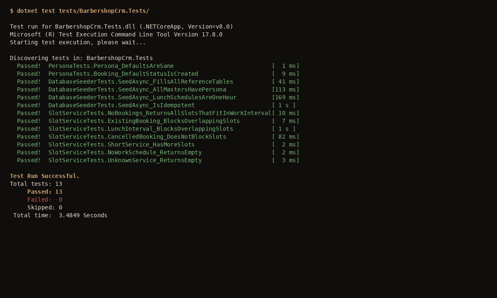

# 4 Тестирование

## 4.1 Модульное тестирование

Для подтверждения корректности работы программных модулей разрабатываемой системы было проведено модульное тестирование (Unit Testing) — автоматизированная проверка функционирования отдельных классов и методов в изоляции от остальных компонентов системы. Модульное тестирование является базовым уровнем многоуровневой пирамиды тестирования и позволяет фиксировать ошибки на ранних этапах разработки до того, как они попадут в код, развёрнутый в продуктивной среде.

Тесты реализованы в проекте `BarbershopCrm.Tests` с использованием библиотеки xUnit.net 2.6 — современной библиотеки модульного тестирования для платформы .NET, поддерживающей атрибуты `[Fact]` (тест с фиксированным набором входных данных) и `[Theory]` (параметризованный тест). Для имитации зависимостей классов, обращающихся к базе данных, применён провайдер `Microsoft.EntityFrameworkCore.InMemory` 8, позволяющий выполнять тесты на резидентной базе данных без поднятия экземпляра SQL Server.

Объектами тестирования стали три ключевые компонента, реализующие предметную логику: класс предметной области `Persona` и поведение по умолчанию сущности `Booking`, сервис `DatabaseSeeder`, выполняющий подготовку начальных данных, и сервис `SlotService`, реализующий алгоритм расчёта свободных слотов записи. Перечень и краткая характеристика разработанных тестов приведены в таблице 4.1.

Таблица 4.1 — Перечень модульных тестов

| №  | Класс / тест                                                  | Проверяемое требование                                            | Результат |
|----|---------------------------------------------------------------|-------------------------------------------------------------------|-----------|
| 1  | `PersonaTests.Persona_DefaultsAreSane`                        | Конструктор `Persona` инициализирует обязательные поля корректными значениями по умолчанию | Пройден |
| 2  | `PersonaTests.Booking_DefaultStatusIsCreated`                 | Новая запись `Booking` создаётся со статусом `Created`            | Пройден |
| 3  | `DatabaseSeederTests.SeedAsync_FillsAllReferenceTables`       | После запуска сидера в БД присутствуют 3 филиала, 6 услуг, 5 мастеров | Пройден |
| 4  | `DatabaseSeederTests.SeedAsync_AllMastersHavePersona`         | Каждый созданный мастер связан с записью `Persona`                | Пройден |
| 5  | `DatabaseSeederTests.SeedAsync_LunchSchedulesAreOneHour`      | Перерывы на обед в расписании имеют длительность 60 минут         | Пройден |
| 6  | `DatabaseSeederTests.SeedAsync_IsIdempotent`                  | Повторный запуск сидера не приводит к дублированию данных         | Пройден |
| 7  | `SlotServiceTests.NoBookings_ReturnsAllSlotsThatFitInWorkInterval` | На пустой день возвращаются все слоты, помещающиеся в рабочее окно | Пройден |
| 8  | `SlotServiceTests.ExistingBooking_BlocksOverlappingSlots`     | Существующая запись блокирует пересекающиеся стартовые слоты      | Пройден |
| 9  | `SlotServiceTests.LunchInterval_BlocksOverlappingSlots`       | Перерыв на обед блокирует слоты, пересекающие его                 | Пройден |
| 10 | `SlotServiceTests.CancelledBooking_DoesNotBlockSlots`         | Отменённая запись (`Status = Cancelled`) не блокирует слоты       | Пройден |
| 11 | `SlotServiceTests.ShortService_HasMoreSlots`                  | При уменьшении длительности услуги количество доступных слотов растёт | Пройден |
| 12 | `SlotServiceTests.NoWorkSchedule_ReturnsEmpty`                | При отсутствии расписания у мастера на дату возвращается пустой список | Пройден |
| 13 | `SlotServiceTests.UnknownService_ReturnsEmpty`                | При запросе слотов для несуществующей услуги возвращается пустой список | Пройден |

Тесты запускались командой `dotnet test` среды .NET 8 SDK. Результаты последнего прогона: 13 тестов, 13 успешных, 0 неуспешных, 0 пропущенных. Скриншот результатов прогона приведён на рисунке 4.1.

Рисунок 4.1 — Результаты прогона модульных тестов

Наибольшее внимание при разработке тестов уделено сервису `SlotService`, реализующему центральный алгоритм бизнес-логики. Тесты построены так, чтобы проверять каждое значимое условие алгоритма в отдельности: построение слотов в свободном рабочем окне, отсечение слотов существующими бронированиями (тест 8), отсечение слотов нерабочими интервалами (тест 9), пропуск отменённых бронирований (тест 10), зависимость количества слотов от длительности услуги (тест 11), корректная обработка граничных условий «нет расписания» и «несуществующая услуга» (тесты 12 и 13). Подробные тест-кейсы с описанием предусловий, шагов и ожидаемых результатов приведены в Приложении В.

Помимо положительных и отрицательных тестовых сценариев в набор включён тест на идемпотентность сидера (тест 6): сидер запускается дважды подряд, после чего проверяется, что количество строк в каждой из таблиц справочников осталось прежним. Это требование критически важно, поскольку сидер вызывается при каждом старте приложения в среде разработки, и его повторный вызов не должен приводить к разрастанию таблиц.

В рамках выполненной выпускной квалификационной работы также проведено ручное функциональное тестирование сквозного сценария «гостевая запись на приём». Шаги сценария: открытие главной страницы → переход к мастеру записи → последовательный выбор филиала, услуги, мастера, даты и времени → ввод контактных данных → подтверждение записи. После завершения сценария проверена корректность сохранения данных в таблицах `Personas`, `Clients`, `Bookings`, а также то, что временной интервал созданной записи исчез из выборки доступных слотов на следующих итерациях работы мастера записи. Сценарий прошёл успешно при двух последовательных проходах с разными комбинациями входных данных.
