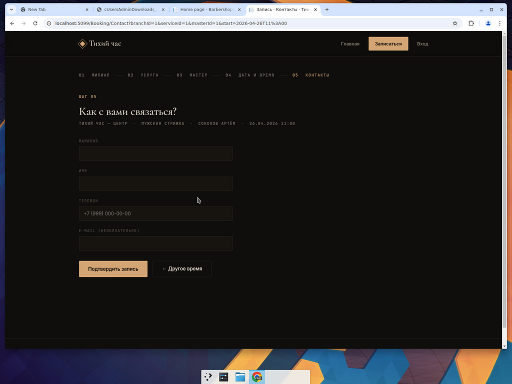
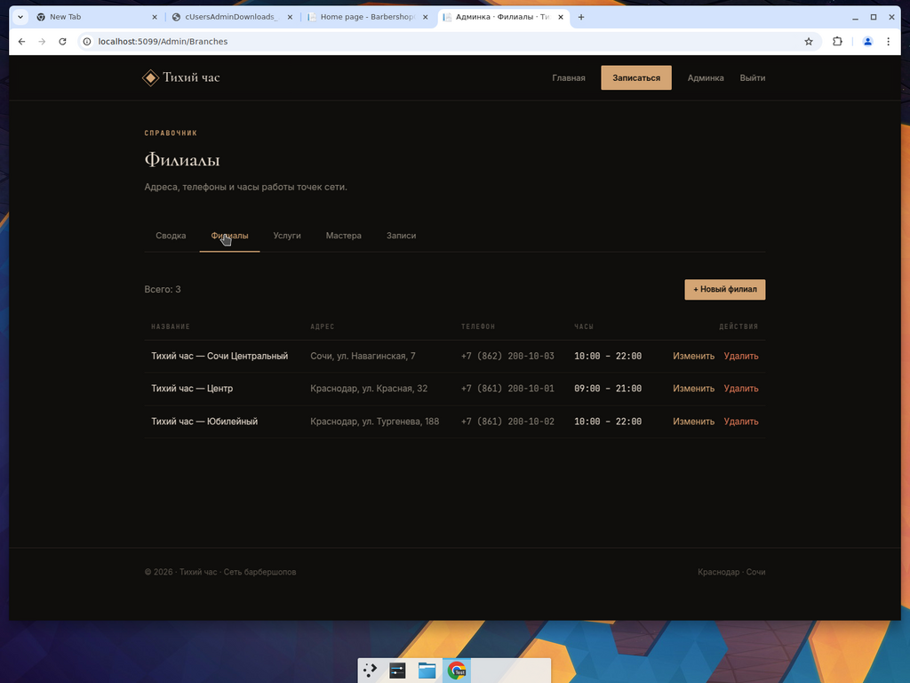

# Приложение Б
## (обязательное)
### Основные экранные формы и программный код

## Б.1 Экранные формы пользовательской части

На рисунках Б.1–Б.7 приведены экранные формы пользовательской (гостевой) части системы.


Рисунок Б.1 — Главная страница приложения


Рисунок Б.2 — Шаг 01: выбор филиала сети


Рисунок Б.3 — Шаг 02: выбор услуги из прайс-листа


Рисунок Б.4 — Шаг 03: выбор мастера


Рисунок Б.5 — Шаг 04: выбор даты и времени из доступных слотов



Рисунок Б.6 — Шаг 05: ввод контактных данных клиента


Рисунок Б.7 — Подтверждение оформленной записи

## Б.2 Экранные формы административной панели


Рисунок Б.8 — Сводка по сети (KPI-карточки и быстрые ссылки)



Рисунок Б.9 — Управление справочником филиалов

## Б.3 Программный код ключевых модулей

### Б.3.1 Сервис расчёта свободных слотов записи

Класс `SlotService` (файл `src/BarbershopCrm.Infrastructure/Services/SlotService.cs`) реализует центральный алгоритм бизнес-логики системы — расчёт свободных временных слотов мастера на заданную дату.

```csharp
using BarbershopCrm.Domain.Enums;
using BarbershopCrm.Infrastructure.Data;
using Microsoft.EntityFrameworkCore;

namespace BarbershopCrm.Infrastructure.Services;

/// <summary>
/// Реализация <see cref="ISlotService"/> на основе <see cref="ApplicationDbContext"/>.
/// Шаг сетки слотов — 15 минут.
/// </summary>
public class SlotService : ISlotService
{
    private const int SlotStepMinutes = 15;

    private readonly ApplicationDbContext _db;

    public SlotService(ApplicationDbContext db) => _db = db;

    public async Task<IReadOnlyList<TimeOnly>> GetAvailableSlotsAsync(
        int masterId,
        int branchId,
        int serviceId,
        DateOnly date,
        CancellationToken cancellationToken = default)
    {
        var service = await _db.Services
            .AsNoTracking()
            .FirstOrDefaultAsync(s => s.ServiceId == serviceId, cancellationToken);

        if (service is null)
        {
            return Array.Empty<TimeOnly>();
        }

        var workIntervals = await _db.WorkSchedules
            .AsNoTracking()
            .Where(w => w.MasterId == masterId
                     && w.BranchId == branchId
                     && w.WorkDate == date
                     && w.ScheduleType == ScheduleType.Work)
            .Select(w => new { w.StartTime, w.EndTime })
            .ToListAsync(cancellationToken);

        if (workIntervals.Count == 0)
        {
            return Array.Empty<TimeOnly>();
        }

        var busyIntervals = await GetBusyIntervalsAsync(masterId, date, cancellationToken);

        var slots = new List<TimeOnly>();
        var duration = TimeSpan.FromMinutes(service.DurationMinutes);

        foreach (var work in workIntervals)
        {
            var candidate = work.StartTime;

            while (candidate.Add(duration) <= work.EndTime)
            {
                var candidateEnd = candidate.Add(duration);

                if (!OverlapsAny(candidate, candidateEnd, busyIntervals))
                {
                    slots.Add(candidate);
                }

                candidate = candidate.AddMinutes(SlotStepMinutes);
            }
        }

        return slots
            .Distinct()
            .OrderBy(t => t)
            .ToList();
    }

    private async Task<List<(TimeOnly Start, TimeOnly End)>> GetBusyIntervalsAsync(
        int masterId,
        DateOnly date,
        CancellationToken ct)
    {
        var nonWorkSchedule = await _db.WorkSchedules
            .AsNoTracking()
            .Where(w => w.MasterId == masterId
                     && w.WorkDate == date
                     && w.ScheduleType != ScheduleType.Work)
            .Select(w => new { w.StartTime, w.EndTime })
            .ToListAsync(ct);

        var dayStart = date.ToDateTime(TimeOnly.MinValue);
        var dayEnd = date.AddDays(1).ToDateTime(TimeOnly.MinValue);

        var bookings = await _db.Bookings
            .AsNoTracking()
            .Where(b => b.MasterId == masterId
                     && b.Status != BookingStatus.Cancelled
                     && b.StartDateTime >= dayStart
                     && b.StartDateTime < dayEnd)
            .Select(b => new { b.StartDateTime, b.DurationMinutes })
            .ToListAsync(ct);

        var busy = new List<(TimeOnly Start, TimeOnly End)>(nonWorkSchedule.Count + bookings.Count);

        foreach (var s in nonWorkSchedule)
        {
            busy.Add((s.StartTime, s.EndTime));
        }

        foreach (var b in bookings)
        {
            var start = TimeOnly.FromDateTime(b.StartDateTime);
            var end = start.AddMinutes(b.DurationMinutes);
            busy.Add((start, end));
        }

        return busy;
    }

    private static bool OverlapsAny(
        TimeOnly start,
        TimeOnly end,
        List<(TimeOnly Start, TimeOnly End)> busy)
    {
        foreach (var b in busy)
        {
            if (start < b.End && b.Start < end)
            {
                return true;
            }
        }
        return false;
    }
}
```

### Б.3.2 PageModel шага «Контакты» гостевой записи

Класс `ContactModel` (файл `src/BarbershopCrm.Web/Pages/Booking/Contact.cshtml.cs`) реализует обработчик последнего шага гостевой записи: создание клиента из его контактных данных и создание записи.

```csharp
using System.ComponentModel.DataAnnotations;
using BarbershopCrm.Domain.Entities;
using BarbershopCrm.Domain.Enums;
using BarbershopCrm.Infrastructure.Data;
using BarbershopCrm.Infrastructure.Services;
using Microsoft.AspNetCore.Mvc;
using Microsoft.AspNetCore.Mvc.RazorPages;
using Microsoft.EntityFrameworkCore;

namespace BarbershopCrm.Web.Pages.Booking;

public class ContactModel : PageModel
{
    private readonly ApplicationDbContext _db;
    private readonly ISlotService _slots;

    public ContactModel(ApplicationDbContext db, ISlotService slots)
    {
        _db = db;
        _slots = slots;
    }

    [BindProperty(SupportsGet = true)]
    public int BranchId { get; set; }

    [BindProperty(SupportsGet = true)]
    public int ServiceId { get; set; }

    [BindProperty(SupportsGet = true)]
    public int MasterId { get; set; }

    [BindProperty(SupportsGet = true)]
    public DateTime Start { get; set; }

    [BindProperty]
    public ContactInput Input { get; set; } = new();

    public Branch? Branch { get; private set; }
    public Domain.Entities.Service? Service { get; private set; }
    public Master? Master { get; private set; }

    public class ContactInput
    {
        [Required(ErrorMessage = "Укажите фамилию.")]
        [StringLength(100)]
        public string LastName { get; set; } = string.Empty;

        [Required(ErrorMessage = "Укажите имя.")]
        [StringLength(100)]
        public string FirstName { get; set; } = string.Empty;

        [Required(ErrorMessage = "Укажите телефон.")]
        [Phone(ErrorMessage = "Неверный формат телефона.")]
        [StringLength(20)]
        public string Phone { get; set; } = string.Empty;

        [EmailAddress(ErrorMessage = "Неверный формат e-mail.")]
        [StringLength(256)]
        public string? Email { get; set; }
    }

    public async Task<IActionResult> OnGetAsync()
    {
        if (!await LoadContextAsync())
        {
            return RedirectToPage("Index");
        }

        return Page();
    }

    public async Task<IActionResult> OnPostAsync()
    {
        if (!await LoadContextAsync())
        {
            return RedirectToPage("Index");
        }

        if (!ModelState.IsValid)
        {
            return Page();
        }

        // Повторная проверка слота — на случай гонки.
        var date = DateOnly.FromDateTime(Start);
        var time = TimeOnly.FromDateTime(Start);
        var available = await _slots.GetAvailableSlotsAsync(MasterId, BranchId, ServiceId, date);

        if (!available.Contains(time))
        {
            ModelState.AddModelError(string.Empty, "Выбранный слот уже занят. Пожалуйста, выберите другое время.");
            return Page();
        }

        // Поиск/создание Persona по нормализованному телефону.
        var phone = NormalizePhone(Input.Phone);
        var persona = await _db.Personas.FirstOrDefaultAsync(p => p.Phone == phone);
        if (persona is null)
        {
            persona = new Persona
            {
                LastName = Input.LastName.Trim(),
                FirstName = Input.FirstName.Trim(),
                Phone = phone,
                Email = string.IsNullOrWhiteSpace(Input.Email) ? null : Input.Email.Trim()
            };
            _db.Personas.Add(persona);
            await _db.SaveChangesAsync();
        }

        // Поиск/создание Client.
        var client = await _db.Clients.FirstOrDefaultAsync(c => c.PersonaId == persona.PersonaId);
        if (client is null)
        {
            client = new Client
            {
                PersonaId = persona.PersonaId,
                Source = "online",
                FirstVisitDate = DateOnly.FromDateTime(Start),
                CreatedAt = DateTime.UtcNow
            };
            _db.Clients.Add(client);
            await _db.SaveChangesAsync();
        }

        var booking = new Domain.Entities.Booking
        {
            ClientId = client.ClientId,
            MasterId = MasterId,
            ServiceId = ServiceId,
            BranchId = BranchId,
            StartDateTime = Start,
            DurationMinutes = Service!.DurationMinutes,
            Status = BookingStatus.Created,
            CreatedAt = DateTime.UtcNow
        };
        _db.Bookings.Add(booking);
        await _db.SaveChangesAsync();

        return RedirectToPage("Success", new { bookingId = booking.BookingId });
    }

    private async Task<bool> LoadContextAsync()
    {
        Branch = await _db.Branches.AsNoTracking()
            .FirstOrDefaultAsync(b => b.BranchId == BranchId);
        Service = await _db.Services.AsNoTracking()
            .FirstOrDefaultAsync(s => s.ServiceId == ServiceId);
        Master = await _db.Masters.AsNoTracking()
            .Include(m => m.Persona)
            .FirstOrDefaultAsync(m => m.MasterId == MasterId);

        return Branch is not null && Service is not null && Master is not null && Start != default;
    }

    private static string NormalizePhone(string raw)
    {
        var digits = new string(raw.Where(char.IsDigit).ToArray());
        if (digits.StartsWith("8") && digits.Length == 11)
        {
            digits = "7" + digits[1..];
        }
        return "+" + digits;
    }
}
```

### Б.3.3 Конфигурация сущностей в ApplicationDbContext

Класс `ApplicationDbContext` (файл `src/BarbershopCrm.Infrastructure/Data/ApplicationDbContext.cs`) определяет конфигурации сущностей и их связей.

```csharp
using BarbershopCrm.Domain.Entities;
using BarbershopCrm.Domain.Enums;
using BarbershopCrm.Infrastructure.Identity;
using Microsoft.AspNetCore.Identity;
using Microsoft.AspNetCore.Identity.EntityFrameworkCore;
using Microsoft.EntityFrameworkCore;

namespace BarbershopCrm.Infrastructure.Data;

/// <summary>
/// Контекст БД CRM-системы. Объединяет таблицы доменной модели и
/// стандартные таблицы ASP.NET Core Identity (AspNetUsers, AspNetRoles и т.п.).
/// </summary>
public class ApplicationDbContext : IdentityDbContext<ApplicationUser, IdentityRole<int>, int>
{
    public ApplicationDbContext(DbContextOptions<ApplicationDbContext> options) : base(options)
    {
    }

    public DbSet<Persona> Personas => Set<Persona>();
    public DbSet<Branch> Branches => Set<Branch>();
    public DbSet<Service> Services => Set<Service>();
    public DbSet<Master> Masters => Set<Master>();
    public DbSet<Client> Clients => Set<Client>();
    public DbSet<MasterBranch> MasterBranches => Set<MasterBranch>();
    public DbSet<MasterService> MasterServices => Set<MasterService>();
    public DbSet<WorkSchedule> WorkSchedules => Set<WorkSchedule>();
    public DbSet<Booking> Bookings => Set<Booking>();
    public DbSet<Visit> Visits => Set<Visit>();

    protected override void OnModelCreating(ModelBuilder builder)
    {
        base.OnModelCreating(builder);

        ConfigurePersona(builder);
        ConfigureBranch(builder);
        ConfigureService(builder);
        ConfigureMaster(builder);
        ConfigureClient(builder);
        ConfigureMasterBranch(builder);
        ConfigureMasterService(builder);
        ConfigureWorkSchedule(builder);
        ConfigureBooking(builder);
        ConfigureVisit(builder);
        ConfigureApplicationUser(builder);
    }

    private static void ConfigurePersona(ModelBuilder b)
    {
        b.Entity<Persona>(e =>
        {
            e.ToTable("Persona");
            e.HasKey(x => x.PersonaId);
            e.Property(x => x.LastName).HasMaxLength(100).IsRequired();
            e.Property(x => x.FirstName).HasMaxLength(100).IsRequired();
            e.Property(x => x.MiddleName).HasMaxLength(100);
            e.Property(x => x.Phone).HasMaxLength(20).IsRequired();
            e.Property(x => x.Email).HasMaxLength(256);
            e.Property(x => x.Gender).HasConversion<int?>();
            e.HasIndex(x => x.Phone).IsUnique();
        });
    }

    private static void ConfigureBranch(ModelBuilder b)
    {
        b.Entity<Branch>(e =>
        {
            e.ToTable("Branches", t => t.HasCheckConstraint("CK_Branches_WorkHours", "[ClosingTime] > [OpeningTime]"));
            e.HasKey(x => x.BranchId);
            e.Property(x => x.Name).HasMaxLength(200).IsRequired();
            e.Property(x => x.Address).HasMaxLength(500).IsRequired();
            e.Property(x => x.Phone).HasMaxLength(20);
        });
    }

    private static void ConfigureService(ModelBuilder b)
    {
        b.Entity<Service>(e =>
        {
            e.ToTable("Services", t =>
            {
                t.HasCheckConstraint("CK_Services_Duration", "[DurationMinutes] > 0");
                t.HasCheckConstraint("CK_Services_Price", "[Price] >= 0");
            });
            e.HasKey(x => x.ServiceId);
            e.Property(x => x.Name).HasMaxLength(200).IsRequired();
            e.Property(x => x.Description).HasMaxLength(1000);
            e.Property(x => x.Price).HasColumnType("decimal(10, 2)");
        });
    }

    private static void ConfigureMaster(ModelBuilder b)
    {
        b.Entity<Master>(e =>
        {
            e.ToTable("Masters");
            e.HasKey(x => x.MasterId);
            e.Property(x => x.Position).HasMaxLength(100).IsRequired();
            e.Property(x => x.AvatarPath).HasMaxLength(500);
            e.Property(x => x.Bio).HasMaxLength(2000);
            e.Property(x => x.IsActive).HasDefaultValue(true);

            e.HasIndex(x => x.PersonaId).IsUnique();
            e.HasOne(x => x.Persona)
                .WithOne(p => p.Master!)
                .HasForeignKey<Master>(x => x.PersonaId)
                .OnDelete(DeleteBehavior.NoAction);
        });
    }

    private static void ConfigureClient(ModelBuilder b)
    {
        b.Entity<Client>(e =>
        {
            e.ToTable("Clients");
            e.HasKey(x => x.ClientId);
            e.Property(x => x.Source).HasMaxLength(100);
            e.Property(x => x.Notes).HasMaxLength(1000);
            e.Property(x => x.CreatedAt).HasDefaultValueSql("SYSDATETIME()");

            e.HasIndex(x => x.PersonaId).IsUnique();
            e.HasOne(x => x.Persona)
                .WithOne(p => p.Client!)
                .HasForeignKey<Client>(x => x.PersonaId)
                .OnDelete(DeleteBehavior.NoAction);
        });
    }

    private static void ConfigureMasterBranch(ModelBuilder b)
    {
        b.Entity<MasterBranch>(e =>
        {
            e.ToTable("MasterBranch");
            e.HasKey(x => new { x.MasterId, x.BranchId });

            e.HasOne(x => x.Master)
                .WithMany(m => m.MasterBranches)
                .HasForeignKey(x => x.MasterId)
                .OnDelete(DeleteBehavior.Cascade);

            e.HasOne(x => x.Branch)
                .WithMany(br => br.MasterBranches)
                .HasForeignKey(x => x.BranchId)
                .OnDelete(DeleteBehavior.Cascade);
        });
    }

    private static void ConfigureMasterService(ModelBuilder b)
    {
        b.Entity<MasterService>(e =>
        {
            e.ToTable("MasterService");
            e.HasKey(x => new { x.MasterId, x.ServiceId });

            e.HasOne(x => x.Master)
                .WithMany(m => m.MasterServices)
                .HasForeignKey(x => x.MasterId)
                .OnDelete(DeleteBehavior.Cascade);

            e.HasOne(x => x.Service)
                .WithMany(s => s.MasterServices)
                .HasForeignKey(x => x.ServiceId)
                .OnDelete(DeleteBehavior.Cascade);
        });
    }

    private static void ConfigureWorkSchedule(ModelBuilder b)
    {
        b.Entity<WorkSchedule>(e =>
        {
            e.ToTable("WorkSchedules", t =>
                t.HasCheckConstraint("CK_WorkSchedules_Times", "[EndTime] > [StartTime]"));
            e.HasKey(x => x.WorkScheduleId);
            e.Property(x => x.ScheduleType).HasConversion<int>();

            e.HasIndex(x => new { x.MasterId, x.WorkDate, x.StartTime }).IsUnique();
            e.HasIndex(x => new { x.MasterId, x.WorkDate });

            e.HasOne(x => x.Master)
                .WithMany(m => m.WorkSchedules)
                .HasForeignKey(x => x.MasterId)
                .OnDelete(DeleteBehavior.NoAction);

            e.HasOne(x => x.Branch)
                .WithMany(br => br.WorkSchedules)
                .HasForeignKey(x => x.BranchId)
                .OnDelete(DeleteBehavior.NoAction);
        });
    }

    private static void ConfigureBooking(ModelBuilder b)
    {
        b.Entity<Booking>(e =>
        {
            e.ToTable("Bookings", t =>
                t.HasCheckConstraint("CK_Bookings_Duration", "[DurationMinutes] > 0"));
            e.HasKey(x => x.BookingId);
            e.Property(x => x.Status).HasConversion<int>().HasDefaultValue(BookingStatus.Created);
            e.Property(x => x.CreatedAt).HasDefaultValueSql("SYSDATETIME()");

            e.HasIndex(x => new { x.MasterId, x.StartDateTime });
            e.HasIndex(x => x.ClientId);

            e.HasOne(x => x.Client)
                .WithMany(c => c.Bookings)
                .HasForeignKey(x => x.ClientId)
                .OnDelete(DeleteBehavior.NoAction);

            e.HasOne(x => x.Master)
                .WithMany(m => m.Bookings)
                .HasForeignKey(x => x.MasterId)
                .OnDelete(DeleteBehavior.NoAction);

            e.HasOne(x => x.Service)
                .WithMany(s => s.Bookings)
                .HasForeignKey(x => x.ServiceId)
                .OnDelete(DeleteBehavior.NoAction);

            e.HasOne(x => x.Branch)
                .WithMany(br => br.Bookings)
                .HasForeignKey(x => x.BranchId)
                .OnDelete(DeleteBehavior.NoAction);
        });
    }

    private static void ConfigureVisit(ModelBuilder b)
    {
        b.Entity<Visit>(e =>
        {
            e.ToTable("Visits", t =>
                t.HasCheckConstraint("CK_Visits_Amount", "[TotalAmount] >= 0"));
            e.HasKey(x => x.VisitId);
            e.Property(x => x.TotalAmount).HasColumnType("decimal(10, 2)");
            e.Property(x => x.MasterNotes).HasMaxLength(2000);
            e.Property(x => x.CompletedAt).HasDefaultValueSql("SYSDATETIME()");

            e.HasIndex(x => x.BookingId).IsUnique();
            e.HasOne(x => x.Booking)
                .WithOne(bk => bk.Visit!)
                .HasForeignKey<Visit>(x => x.BookingId)
                .OnDelete(DeleteBehavior.NoAction);
        });
    }

    private static void ConfigureApplicationUser(ModelBuilder b)
    {
        b.Entity<ApplicationUser>(e =>
        {
            e.HasIndex(x => x.PersonaId).IsUnique();
            e.HasOne(x => x.Persona)
                .WithOne()
                .HasForeignKey<ApplicationUser>(x => x.PersonaId)
                .OnDelete(DeleteBehavior.NoAction);
        });
    }
}
```
